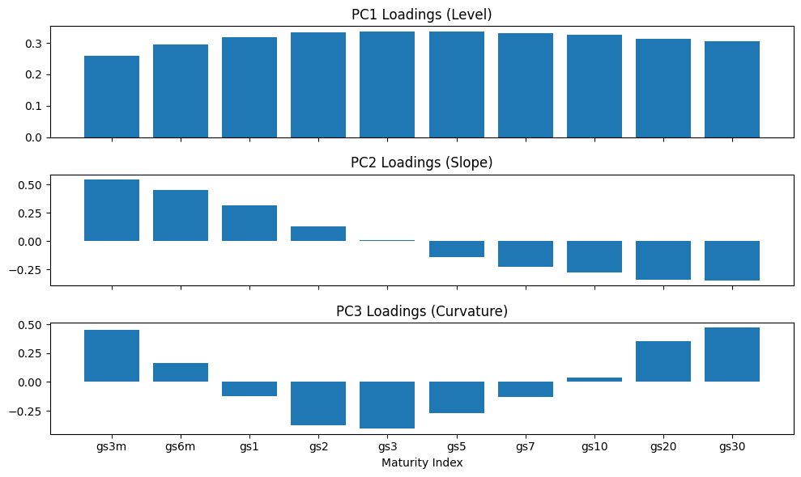

# Yield Curve PCA

This project models U.S. Treasury yield curve dynamics using PCA to extract
level, slope, and curvature factors and tests simple mean-reversion trading signals.

## Data
- WRDS Treasury Yield Curve
- Daily maturities: 3M–30Y
- 2000–present

## Methodology
- Yield changes (Δy)
- Standardization
- PCA on covariance matrix
- Factor interpretation
- Signal backtesting

## Results
- PC1: Level (~84%)
- PC2: Slope (~12%)
- PC3: Curvature (~2%)

## PCA Loadings (Yield Curve Shapes)

The first three principal components correspond to the canonical
level, slope, and curvature movements of the U.S. Treasury yield curve.

